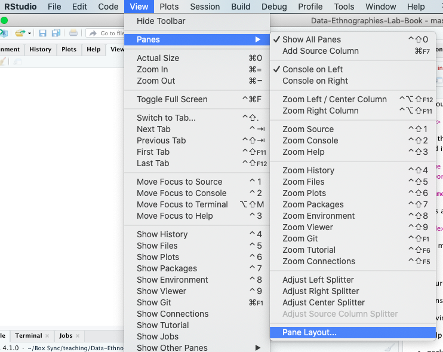
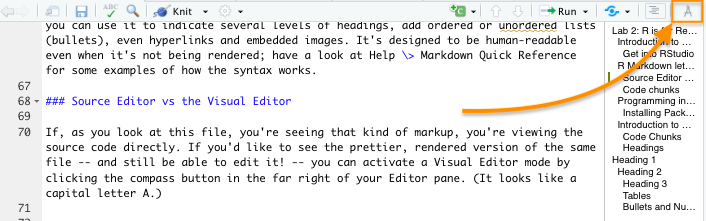
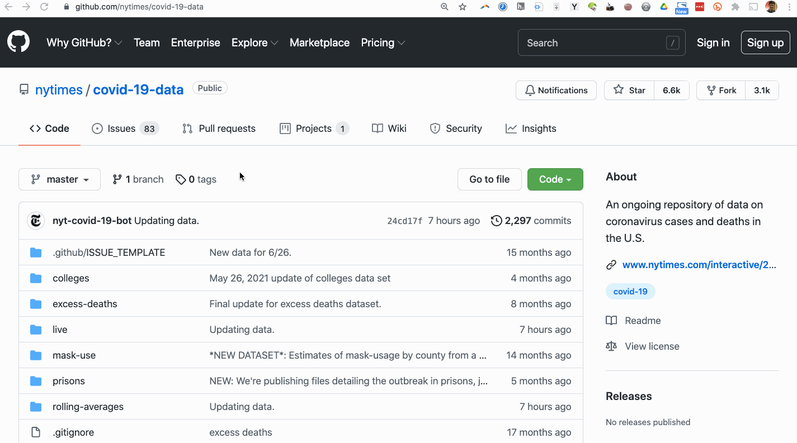

# Lab 2: R is for Repeatable, Revisable Analysis

## Introduction to R and RStudio

There are many tools out there for data analysis, and many of them promise to make that analysis easier by removing the need to learn code. Sometimes, that's great, and all you need! Sometimes, those tools will make beautiful graphs or other graphics that help you tell a great data story. But I still believe it makes sense to get into the code, anyway, for a few reasons:

-   to give you a better feel for the content and structure of your own datasets, so you can detect errors in analytical assumptions or know what to filter and pass along to those more automatic tools;

-   to make your analyses replicable, both to check your own work and to inspire or adapt from other people's code;

-   to build a sense of what's possible with code, so that even if you don't continue working with it, you are better able to communicate with those who do; and

-   relatedly, to spread coding knowledge for purposes of ethical intervention. As my colleague Annette Vee argues in her book *Coding Literacy*, "If we want a more inclusive and equal society, the writing of code should not be left to a handful of elite or isolated groups" (224).

The particular coding environment I'm asking you to use is RStudio, a user interface around the R programming language. Not to make too much out of the distinction, but:

**R** is a statistical computing *language* that allows you to:

-   Store data in a variety of formats
-   Perform calculations on data and variables,
-   Build functions and applications, and
-   Transform and graphically represent data

**RStudio** is an *Integrated Development Environment* (IDE) for statistical computing. It is a platform for coding in R that helps you write documents, track variables and their contents, and inspect visual outputs of your code, like plots and graphs.

If you don't yet have it, here's the link to [download RStudio](https://www.rstudio.com/products/rstudio/download/). The free RStudio Desktop version should be fine! Note that there are two steps: you must download and install the R application before you can install the RStudio IDE. And if for some reason you can't install RStudio on your computer -- if you're on a Chromebook, say -- you can try [RStudio Cloud](https://www.rstudio.com/products/cloud/).

::: {.alert .alert-info}
NB: At this point in class, I gave a tour of RStudio and the development tools it integrates; if you missed it, or want a recap, please watch [this short video](%22https://www.youtube.com/watch?v=f0lXHfwLqW4%22). (It runs about 14 minutes at normal speed, but you may be able to get away with playing it faster.)
:::

Before moving on, you should be able to define and locate the following elements of the RStudio IDE:

-   source editor

-   console

-   environment

-   help / documentation

-   package manager

-   plot window

::: {.alert .alert-info}
To rearrange windows to your heart's content, use **View \> Panes \> Pane Layout...** .

{width="441"}
:::

### Get into RStudio

If you've been viewing this file in a browser or text editor up to this point, **please re-open it in RStudio.** This will allow you to execute the code that appears in blocks below, sometimes modifying it first.

### Packages and Libraries

The R community has developed a series of *packages:* collections of functions that we can use when coding in R. We will be leveraging a series of packages known as the Tidyverse - designed to help users clean, transform, analyze, and visualize data. As we work through these labs, you will need to have the following packages installed in your R environment. To add them, please **copy and paste the following line into your Console**. *If you're given the option, do allow R to install dependencies.*

> install.packages(c("tidyverse", "lubridate", "rmarkdown", "leaflet", "jsonlite"))

::: {.alert .alert-warning}
NB: don't include the `>` character, if you see it.
:::

Once it's installed, to load a package, we call the function `library()`, which lets R know that we will be referencing the functions encoded for this package in our code. You might think of an R package as a book, stored in a computer library. When you call `library()`, it is as if we are checking that book out of the library so that we may reference its functions in our code.

Copy and paste the code below into the console after installing the packages above, to try the first library we'll work with, and make sure it installed properly.

> library(rmarkdown)

## R Markdown lets you make pretty files that still run code

This file ends in .Rmd, indicating that it is in the **R Markdown** format. Markdown, in general, is a shorthand that lets you add structure to otherwise plain text files: you can use it to indicate several levels of headings, add ordered or unordered lists (bullets), even hyperlinks and embedded images. It's designed to be human-readable even when it's not being rendered; have a look at the Help menu (at the top of the whole RStudio app), and at the bottom click on \> Markdown Quick Reference for some examples of how the syntax works.

### Source Editor vs the Visual Editor

If, as you look at this file, you're seeing that kind of markup, you're viewing the source code directly. If you'd like to see the prettier, rendered version of the same file -- and still be able to edit it! -- you can activate a Visual Editor mode by clicking the compass button in the far right of your Editor pane. (It looks like a capital letter A. If you're not seeing it, you may have an older version of RStudio.)



The same button can be used to toggle back to the source code.

### Code chunks

*R* Markdown adds some tools specific to R -- most importantly, executable code.

```{r eval=FALSE}
This grey box between ```{r} and ``` is a code chunk.

Typically, when we put code in this chunk and then publish our R Markdown document, the code written here will be run and output on the screen.

However, by placing `eval=FALSE` in the brackets, we tell R (and you, while you're doing the lab) not to evaluate this code.
This is useful when we are just filling text into the code chunk.
```

Here's an example of an executable code chunk:

```{r}
# This is going to output a friendly greeting.
print("Hello, world!")        # See? Friendly!
```

When you click on the green arrow at the top right, it will pass the command into your console and produce the output. Give it a try!

## Programming introduction / particularities of R syntax

At this point, we will begin to review some basic functionality in R. If you have coded in R before, this will largely be a refresher. If you have never coded in R before, or even if you've never coded at all, don't worry! This section is primarily designed to get you acclimated to the language and symbols you will see in future labs. Later labs will review some of this material as you compose your own code in R. As you read through each section, be sure to run the code chunks to see how the code is operating.

Notice that in the chunk above one value was produced -- the message "Hello, world!" -- and it is displayed after a `[1]`. R asssumes that you'll be interested in how many values you have, so it generally tells you. But those numbers are not part of the output.

Notice, as well, that anything following the `#` in a line is not output; those lines are *comments*, and are aimed at human audiences (including your own future self), often describing what the adjacent lines are meant to do.

### Assigning Variables

To keep values in R for reuse, we use "\<-" to assign a variable. The text that comes before "\<-" will be our variable name, and the text that comes after "\<-" will be the value stored in it. These new variables do not need to be declared ahead of time; just using the "\<-" syntax will create them, if necessary.

```{r}
course_name <- "Writing with Data"
```

Unlike when you ran the `print()` command above, assigning a variable doesn't generate any output. However, if you pass just the variable name to the console, R will assume you want to print its contents to the screen:

```{r}
course_name

```

Let's get some more variables into memory to work with!

```{r}
#Run this code chunk.

course_dept <- "ENGCMP"
course_number <- "0521"
course_size <- 20

firstyears <- 0
sophomores <- 5
juniors <- 7
seniors <- 8

dsas <- 14
swanson <- 4
business <- 2
```

NB: The green arrow executes the whole code chunk. You can also execute just one line at a time by placing your cursor on it and hitting Cmd+Enter (on a Mac) or Ctrl+Enter (on a PC).

If someone drops or adds the class, we can easily change the value of the `course_size` variable.

```{r}
#Store the calculation in a variable.
course_size <- course_size - 1

#Print the variable
course_size
```

Notice how we re-assigned the new subtracted value to the same `course_size` variable above; *this now replaces the old value.* (Be warned that there's no automatic "undo" in R, so when you work with real data be sure you're ready to do this! That said, you'll also be saving all your code, so you could, if you needed to, re-run all the lines up to that point. In fact, there's a button in every code chunk to do just that, to the left of the green arrow.)

### Variable classes

Every object in R has a particular *class*, which designates the variable's "type" and how/whether functions can be applied to it. We can check the class of a variable by calling it in "class()".

```{r}
class(course_name)
class(course_size)
class(course_number)
```

> One other variable class worth mentioning is 'factor': it looks like a character string, but it's constrained to a set number of possible values, called 'levels.' These can be used to filter the data, but I find they're often more constraining than enabling. We may discuss factors as we get further on; for now, just know they exist, and ask me if they start giving you any problems.

Did you notice how `course_number` above is a character variable? This is because when we created `course_number` above, we put the number in quotation marks - indicating to R to treat the number as a set of characters rather than a number. Since our class number is a reference to our class, it acts more like a label than a number. This will be important later, during data cleaning.

### Operating on variables

We can also perform calculations on variables, such as addition, subtraction, multiplication, and division. Checking whether variables are greater than, less than, or equal to each other will return TRUE or FALSE.

```{r}
juniors + seniors

dsas > swanson
```

We can also perform operations on strings - e.g. joining them with the `paste()` function. For instance, we can paste the `course_dept` string together with the `course_number` string to create a combined class code. When we do this, we need to tell R what characters should separate the strings. We will review this again later on, as a potential part of data cleaning.

```{r}
course_code <- paste(course_dept, course_number, sep=" ")
course_code
```

### Sidebar: Getting Help

We've now seen two commands, or functions: `print()` and `paste()` . If you ever want more information on what inputs a function can take, you can check the built-in documentation by using a third function: `help()`, or the shortcut form, `?`. Typing `?paste` (or, equivalently, `help(paste)`) will bring up a detailed manual page about it.

If the help page isn't informative enough, I find that Googling usually leads me to some helpful walkthrough or [Stack Overflow](https://stackoverflow.com/questions/tagged/r?tab=Votes) page.

### Vectors

A vector is a set of values that are all of the same type. A vector can be of type integer, double, character, or logical, for example. We create a vector by placing a set of values in "c(\_\_\_)". The 'c' stands for 'concatenate', but if that's not helpful you can also think of c as standing for "combine" - indicating that we are combining values within a single variable.

```{r}
birth_months <- c(4, 7, 12, 3, 1, 7, 2, 6, 5, 2, 8, 10, 8, 3, 4, 4, 2, 6, 11)
first_letter_name <- c("K","C","J","M","A", "J", "J")
pets <- c(1, 1, 1, 1, 2, 2, 2, 3, 3, 3, 4, 8, 8, NA, NA, NA, NA)
```

Note that, unlike when combining sets in math, `c()` will preserve items' order and allow them to repeat within the vector.

```{r}
print(birth_months)
print(first_letter_name)
```

You can also use `c()` to combine vectors. Note that, if the result of an operation is a value (rather than, say, assigning a value to a variable), R will print it by default.

```{r}
c(birth_months, birth_months)
```

When R prints a vector, it will also indicate in the left-hand margin the position within the vector at which that line starts. (Remember that `[1]` from above?) We can extract values from specific positions in the vector by referencing the index in square brackets. So let's say I want to extract the third value in the vector.

```{r}
first_letter_name[3]
```

To extract all values except the value in a particular position, we will use the "-" sign before the index in brackets. So let's say I want to extract all values except the third in the vector.

```{r}
first_letter_name[-3]
```

We can also extract a range of values from specific positions in the vector by referencing that range of indexes in brackets separated by a ":". So let's say I want to extract the first through the third value in the vector.

```{r}
first_letter_name[1:3]
```

Finally, to extract values from a non-sequential combination of specific positions in the vector, we can reference each of their indexes in brackets in "c()".

```{r}
first_letter_name[c(1,3,5:7)]
```

We can measure the length of a vector by calling the function `length()`. This counts how many values are listed in the vector.

```{r}
length(birth_months)
```

We can perform operations on vectors - finding their max, their min, their sum, their average, for example. However, we may get an error if we have any empty values in the dataset. To avoid this, we need to communicate to R to remove NA values.

```{r}
max(birth_months)

max(pets)
min(pets)
sum(pets)
mean(pets)

max(pets, na.rm=TRUE)
min(pets, na.rm=TRUE)
sum(pets, na.rm=TRUE)
mean(pets, na.rm=TRUE)
```

### Lists

*Lists* are collections of objects in R. For instance, you can have a collection of numeric vectors, character vectors, logical vectors, matrices, and other lists. You can assign names to the objects in lists so that you can more easily reference them. For instance, below I assign the name x, y, and z to the three objects respectively. Once a name has been assigned to the object, you can reference it by listing the name of the list followed by the `$` symbol followed by the name of the object.

```{r}
first_list <- list("initial" = first_letter_name,
                   "pets" = pets,
                   "births" = birth_months)

first_list$initial
first_list$initial[2:3]
first_list$pets[c(1,4)]
first_list$births[2]
```

Lists can also nest inside other lists, which may remind you of the JSON format some data comes in: occasionally you'll find data nested inside one element of a list that otherwise contains metadata. To extract the inner list object, you can simply repeat the process of adding `$` until you reach the right path:

```{r}
second_list <- list("compiler" = "Ben",
                    "last_updated" = 2021,
                    "data" = first_list
                    )

second_list$data$initial
second_list$data$pets[c(1,4)]
```

If you try to reference a part of a list that doesn't exist, R will return the special value `NULL`.

```{r}
second_list$first_list
```

The exception is for assignment: if you assign something to a list using the `$` notation, it will create a new element of the list with that name and value.

```{r}
second_list$status <- "active"
str(second_list)
```

### Data Frames

In these labs, we will be working primarily with rectangular datasets in a data type called a *data frame*. A data frame has a certain number of rows and a certain number of columns. It is a list of *vectors* of all the same length.

**From this point forward, we will refer to each *row* in a data frame as an *observation* and each *column* in a data frame as a *variable*.** This is because rows refer to something that we see in the world, and columns describe that thing we are seeing. Imagine we have a table like this below.

| Name  | Age | Birth Month | Total Pets |
|-------|-----|-------------|------------|
| Alex  | 23  | 3           | 7          |
| Brett | 40  | 2           | 18         |
| Chris | 14  | 8           | 11         |

Each row is an observation - in this case a person - and each column is a variable describing something about a person. Note how each column is also a vector. The Name column is a character vector of names. The Age column is a numeric vector of ages.

Let's go head and create this data frame below:

```{r}
df <- data.frame(name = c("Alex", "Brett", "Chris"),
                 age = c(23, 40, 14),
                 birth_month = c(3, 2, 8),
                 total_pets = c(7, 18, 11))
```

Note that the naming procedure is very similar to lists, but data.frames are more constrained: they require that each item be of equal length.

We *could* extract particular rows and columns in a data frame by referring to their indexes in brackets.

```{r}
df[2,4]
```

However, we often don't want to have to count the index of each column in order to refer to a particular variable in our data.frame -- and, in fact, it's risky to do so, because we may insert or remove a column later on. Instead, refer to the variable (column) name using the same `$` notation discussed above for lists. For instance, we could see the values in the birth_month column by calling:

```{r}
df$birth_month
```

If I wanted the extract the second observation in the birth_month, I would call:

```{r}
df$birth_month[2]
```

What if you don't know what the column names are? To see a list of column names, we could refer to the data dictionary. Or, without leaving R, we could use the function `colnames()`.

```{r}
colnames(df)
```

## Why not just use Excel? It's mostly about scale

The examples so far use a much, much smaller data frame than you'll usually be consulting for analysis. **When working with very large datasets, we need tools to help us get a sense of the dataset** without having to display the entire data frame. Excel doesn't offer that functionality.

In R, though, we can view the first 6 rows of the dataset by calling `head()`:

```{r}
head(df)
```

`dim()` will tell us the dimensions of the data frame - i.e. the number of rows and the number of columns in the data frame.

```{r}
dim(df)
```

`str()` provides a great deal of information about the observations in the data frame, including the number of variables, the number of observations, the variable names, their data types, and a list of observations.

```{r}
str(df)
```

Finally, remember the RStudio tab called Environment? (Not seeing it? Try View \> Panes \> Pane Layout...) If you click on that tab, you should see all of the data that you have stored in variables. You can check column names, structure, and even click to preview data frames there.

### ... and also functions and loops

The other advantage of R is that it's a full programming language: it allows you to define new functions for things you need to use repeatedly, or to iterate over some set of values that you may not know in advance. I won't get deep into the weeds here, but here are a few structures you should at least be able to recognize: **functions**, **conditionals**, and **loops**.

```{r}
# A **function** takes some input (known as parameters, all surrounded by parentheses and separated by commas), passes it through some operations (contained within curly brackets), and returns an output. In R, a basic function definition looks like this:

myfun <- function(a, b) {
  ans <- b * b - 2 * a
  return(ans)
}

myfun(2, 3)

```

That was kind of a silly example, but you might define a function that extracts just the value from a key:value string, or that represents some tax formula you need to compute for every row of a dataset, etc. Anywhere you'd want to re-use the transformation of input to output, a function will serve you well. In my own work, I often define entire complex analyses as large wrapper functions, which allows me to re-generate figures with different subsets of data just by changing the parameters I pass in.

```{r}
# A **conditional** allows for different code to run, depending on whether some statement is true.

if (business > swanson) {
  print("More of us are in the College of Business than are in Engineering.")
} else {
  print("Engineering students outnumber Business students.")
}

```

You might use conditionals to set plot colors based on whether a value is above or below some threshold -- or just to check that you've got the right class of variable before you try to manipulate it.

```{r}
# A *loop* tells the computer to perform the same task over and over again, until some condition is met. One of the more common loop structures looks like this:

for (i in 1:5) {
  print(i^2)  
}
```

This *for loop* says, run through every value in the second item (here, the numbers 1 through 5), temporarily assign it to the variable in the first item (here, the letter i), and then do whatever commands are within the curly brackets. The example above is a little too canned; but you can imagine using this to loop through some set of conditions, or for that matter, through a series of real values -- even when we don't know how many of them there might be:

```{r}
for (pet_count in pets) {
  print(paste("One of your classmates has had", pet_count, "pets in their life so far."))
}

```

## Scaling up

Now let's get a big dataset to work with: the New York Times [Covid-19 cases dataset](https://github.com/nytimes/covid-19-data), which they make publicly available on GitHub as a CSV file. You could download this and load from a local filepath, but it's also easy enough to import directly from the web. In both cases, you can use the base R function read.csv (Note that to find the URL (or "endpoint") for files on GitHub, you need to click the "raw" link on the file page:

{style="max-width: 100%;"}

Run this code chunk to load in the NY Times data and perform a basic inspection of its contents.

```{r}
##### Set 1: NY Times COVID-19 cases 
cases <- read.csv("https://raw.githubusercontent.com/nytimes/covid-19-data/master/us-counties.csv") 

# str() gives us an overview of the structure of the dataset, including the number of observations, the variable names, and each variable's type. 
str(cases)
```

As of the last time I updated this, there were 1,758,129 rows in this data frame. Not something I recommend opening in Excel!

Even in R, it's too much to show all at once: try typing `cases`{style="font-variant-ligatures: normal; white-space: normal;"}, not in R markdown, but at the console, and hitting enter. The rows quickly run far off the screen and then hit a maximum. I want to talk about something else in the output of `str()`, but it's probably really annoying to find now, right? Let's get it back again.

```{r}
str(cases)
```

Notice the variable types: the date variable is treated as a character string, which would make it hard to calculate things like rolling averages; we want those to be recognized as a real calendar date format. Another subtle thing you might not notice: the FIPS codes, which are unique identifiers for counties, are all supposed to have exactly five characters. But it's been imported as an integer, so several values have lost their initial zeroes.

```{r}
# head() shows the first 6 lines, by default, but also allows you to change the number of observations shown.

head(cases, 10)
```

## Enter the Tidyverse

These kinds of formatting problems pop up regularly in data import and analysis, and there are recipes out there to solve them (some of which we might well need). But to make that process easier, a team of open source heroes have codified some of those recipes into libraries of functions that try to simplify the process -- and even, sometimes, to anticipate the problems and fix them for you. The "Tidyverse" package is really a bundle of these libraries that build on and play nicely with one another.

Let's load it up (you should have installed it way back at the start of this lab) and get a taste for how it works.

```{r}
library(tidyverse)  # a whole suite of helpful functions
```

### Import smarter

The tidyverse function to read in a CSV file is subtly different from the one in "base R": it has an underscore instead of a period. But behind the scenes, it's going to make more educated guesses about what the variables are trying to be, and format them appropriately:

```{r}
# The tidyverse adds a new variable class  -- the tibble -- that defaults to a cleaner display. It also includes the `read_csv()` function from the package `readr` that tries to infer variable types, and gives you the option of specifying them manually if you prefer. For more, see `?read_csv`.
cases2 <- read_csv("https://raw.githubusercontent.com/nytimes/covid-19-data/master/us-counties.csv")
```

Let's check the structure again:
```{r}
str(cases2)
```

And if we type `cases2` at the console? 

```{r}
cases2
```

Much nicer, I think! We get 10 rows by default, row numbers less likely to look like a column of data, and both the *date* and *fips* vectors are in the correct format: the leading 0's are preserved.

We can probably get rid of the old one now:

```{r}
cases <- cases2  # remember that this will overwrite the old `cases`.
rm(cases2)       # the rm() function removes unneeded variables from the environment.
```

For a handy overview of the readr package, and other tidyverse options for importing various kinds of data, see this [data import cheatsheet](https://raw.githubusercontent.com/rstudio/cheatsheets/master/data-import.pdf).

### Flow one step into the next with pipes

Tidyverse assumes that you're often going to want to build an analysis iteratively, each new step building on the previous -- and all those steps probably building on the data itself. To make that easier, it introduces a new operator, the pipe, which looks like this: `%>%`. What the pipe does is take the object to its left, and pass it as the first parameter of some function to its right.

It might be easier to see than to say:

```{r}
# In base R, to show the first 15 lines, you can use `head()` as we did above:
head(cases, 15)

# The following tidyverse syntax is exactly equivalent:
cases %>% head(15)

```

Once you have the pipe syntax, you can string a whole series of them together:

```{r}
cases %>%
  filter(county == "Allegheny") %>%            # find rows that make the statement true
  head(5)                                      # display the first 5 rows of results

cases %>% 
  filter(county == "Allegheny") %>%            # find rows that make the statement true
  mutate("new_cases" = cases - lag(cases)) %>% # add a new variable based on existing 
  select(new_cases) %>%                        # choose a column
  max(na.rm=TRUE)                              # perform a calculation on that column

cases %>% 
  filter(county == "Allegheny") %>%            # find rows that make the statement true
  mutate("new_cases" = cases - lag(cases)) %>%    # add new variables based on old ones
  filter(new_cases == max(new_cases, na.rm=TRUE))    # find rows based on a calculation
                                
```

As these examples demonstrate, there are quite a number of handy utility functions for filtering observations, selecting variables to display, and even calculating new values on the fly.

For an overview of these data-manipulation functions, see the [dplyr cheatsheet](https://raw.githubusercontent.com/rstudio/cheatsheets/master/data-transformation.pdf): it's like a set of good pliers for rectangular datasets. There's a [cheatsheet for Base R](https://raw.githubusercontent.com/rstudio/cheatsheets/master/base-r.pdf), too, and sometimes that's all you need. (The R folks do like a good cheatsheet: they've got [lots](https://www.rstudio.com/resources/cheatsheets/).)

In the next few labs, you'll be practicing with these and other functions to clean and explore datasets of your own.


