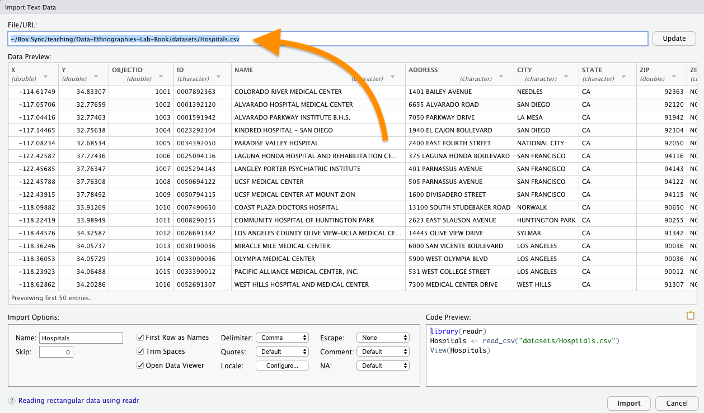

# Lab 3 addendum (Q&A)

A few data-reading challenges came up in class that I thought were worth sharing more widely.

## I need to read in an Excel file

There are built-in tools in the tidyverse for this, but they're not loaded automatically when you run `library(tidyverse)`.

```{r}
library(readxl)    # loads the functions for working with Excel files

?read_excel        # loads the help page for the read_excel() function

```

The one catch is that read_excel [can't (yet) handle file paths directly from the internet](https://github.com/tidyverse/readxl/issues/278); you'd have to download them and use a local filepath. There are some good workarounds in that linked thread, though, which you're also welcome to try. For example:

```{r}
# Suppose you have some remote data at some url; here, I'm using Carnegie Classifications of Institutions of Higher Education
url <- "https://carnegieclassifications.iu.edu/downloads/CCIHE2018-PublicData.xlsx"

# You can save tht information to a temporary file...
tf = tempfile(fileext = ".xlsx")
  curl::curl_download(url, tf)
  
# And read from the temp file instead, into a variable name of your choosing
xl_data <- readxl::read_excel(tf, sheet = "Data")
head(xl_data)

# Then you can delete your temp file and remove its variable from the environment
file.remove(tf)
rm(tf)

```

## I need to find the path to a local file

If you'd rather not mess around with temp files, or you just like having a local file to work with for when your internet is spotty, you can totally import data from a file on your own computer. It works in much the same way as specifying a URL for a path, but instead of internet domains, you'll be describing file directories.

As explained in [this short video](https://www.youtube.com/watch?v=D1CpiGsXIS4), if you can find the file in your Files tab, you can get the path from right within RStudio.

### Method 1

Use the Files tab to click around until you can see the file. Click the "More" button and "Copy Folder Path to Clipboard."


Now you can paste that folder path together with your filename and voila! you have a filepath.

```{r eval=FALSE}
# paste in from the clipboard to get mydir (but note that this won't work on your computer, because you don't have my files or directories!)
mydir <- "~/Box Sync/teaching/Data-Ethnographies-Lab-Book/datasets"
myfile <- "Hospitals.csv"

# string directory and filename together with the file.path() command
myfile <- file.path(mydir, myfile)   

df <- read_csv(myfile)
```

### Method 2

Use the Files tab to click around until you can see the file. Left-click on it, and choose "import dataset." The direct path to the file will appear at the top of the dialog box; copy that and paste it into your source code as in Method 1 -- but now you have the whole path to myfile, with no need to use `paste()`.




### Method 3

Start like method 2, but now notice that in the bottom right of the same dialog there's some code similar to what I'd been asking you to create manually. In fact, you can use this dialog to tweak the classification of variables you're importing, in case readr gets it wrong -- and when you click "update" (top right), this code will change to capture the adjustments you've made.

Copy the code from that box and paste it into your source -- though note that you probably already have readr active, and you probably don't need to View the whole dataset, so you might be able to safely delete the first and last lines of what they give you. Just make sure the `read_csv` or `read_excel` command is included, along with any options inside its parentheses.


Why paste it into code, instead of using the dialog box? For ease of replicability. So you can just run that code next time you start up R, and not have to fiddle with the dialog box again to get your data.

## Every variable in my data is its own named list, rather than together in a table: do I need to transpose it?

Not necessarily. When you run `str()`, R is going to give you a text outline of the data structure, regardless of the data structure -- in other words, it's not going to treat rectangular data as a rectangle, but rather as a list. So the variable names you might expect to see across the tops of the columns will instead run down the page, one per line, with a `$` in front of each.

Try viewing it as a tibble (or, if it's too big, at least check the `head`) before you stress too much about it.

```{r}
# Using the CCIHE dataframe from earlier, str() looks a little scary:
str(xl_data)

# But in fact it's perfectly usable as-is, with one observation per row and one variable per column:
head(xl_data)

```

## My data is stored as a nested data.frame (i.e. there are lists within lists)

This does happen sometimes, and probably most often when your data starts out in JSON or XML, where some elements are allowed to be nested. The tidyr package has some swanky new(ish) functions you can use to flatten or extract just the pieces you want. To see how these functions work (with code examples), run this code block:

```{r}
vignette("rectangle")
```

## My data is stored as cell values at the intersection of two variables (i.e. each row contains multiple observations)

This is a sensible and efficient table format for human readers noticing trends across either/both rows and columns, so it makes sense that you might find data this way: cross tabs of age and race, for example, with income in each cell. But this format makes some kinds of computer-aided analysis trickier, including some visualizations where you want to map certain variables to certain visual features.

Luckily, the tidyr package comes to the rescue again! There are some new(ish) functions here, too, to clarify how to reshape this data into something you can analyze more easily within the tidyverse.

To see how they work (with code examples), run this code block:

```{r}
vignette("pivot")
```

## What was that thing you did in Lab 3 with the for loop and the max_chunks? Do I have to do that with my dataset?

Hopefully not! That example was meant to show how to solve a specific problem: when you're seeing way less data in R than was promised in the online description of the database. If you have the same number of rows as the metadata promised you, you can probably skip right on through.

## What else?

If other questions arise, please do let me know!
